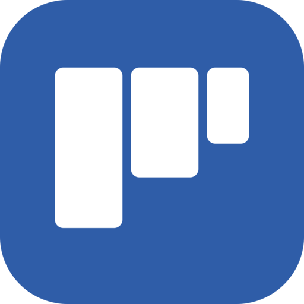
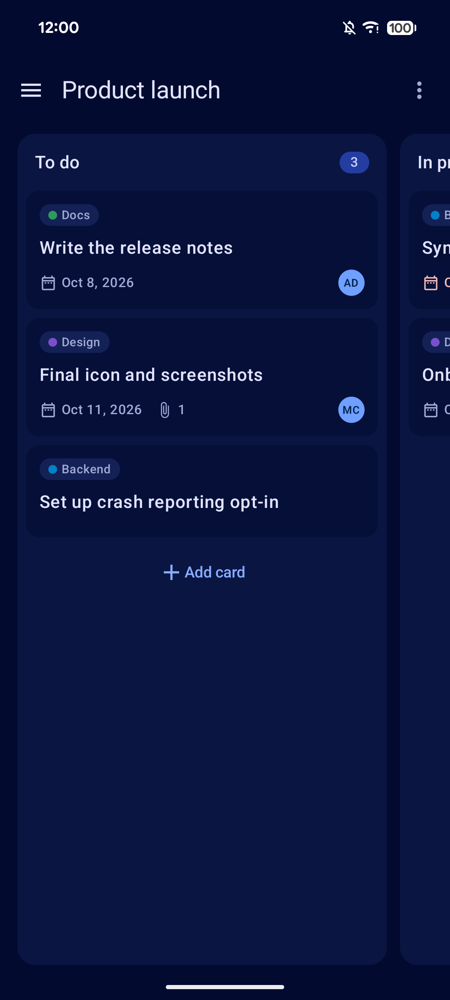
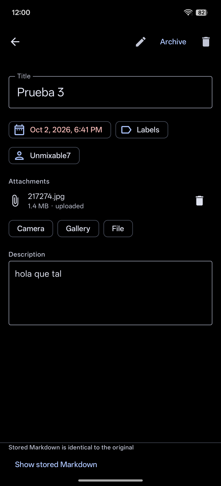
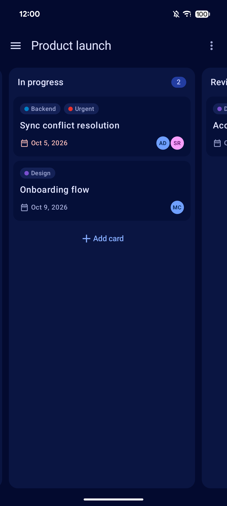

<!--
SPDX-FileCopyrightText: 2026 UltimateDeck contributors
SPDX-License-Identifier: GPL-3.0-or-later
-->

<div align="center">



# UltimateDeck

**Your Nextcloud Deck boards, offline first.**

[](https://github.com/qtekfun/UltimateDeck/actions/workflows/ci.yml)
[](LICENSE)
[](#requirements)

[](https://github.com/qtekfun/UltimateDeck/releases/latest)
<!-- The F-Droid badge goes next to this one once the app is published there. -->

&nbsp;
&nbsp;


</div>

A modern, offline-first Android client for [Nextcloud Deck](https://apps.nextcloud.com/apps/deck): your Kanban boards in a Trello/Jira-like mobile app that keeps working without a connection and syncs when it can.

Free software (GPL-3.0-or-later), with no Google services, no ads and no telemetry. Built for [F-Droid](https://f-droid.org).

## Features

- **Offline first**: boards, columns and cards live on the device; every change is saved at once and synced later through a queue that survives restarts.
- **Boards**: columns side by side with snap scrolling, drag and drop (and accessibility actions to move cards), pull to refresh, a favorite board that opens at start, archived cards view.
- **Cards**: create, edit, move, archive and delete; title and description edited in place with a WYSIWYG Markdown editor; due date and time, labels and assignees; attachments from the camera, the gallery or any file, uploaded in the background with retries.
- **Conflicts handled, never silently lost**: if a title or description changed both here and on the server, you choose which version to keep. Other fields follow "last change wins".
- **Due date reminders**: local notifications at the exact time (optional "alarm clock" mode for phones that delay alarms).
- **Settings**: light/dark/system theme, pure black AMOLED mode, Material You colors, English and Spanish.
- **Secure**: HTTPS only, app password obtained through Nextcloud's Login Flow v2 and encrypted with the Android Keystore.

## Requirements

- Android 8.0 (API 26) or newer.
- A Nextcloud server with Deck 1.3 or newer (API v1.1).

## Building

The project uses Gradle with the version catalog in `gradle/libs.versions.toml`. Gradle needs JDK 21.

```sh
./gradlew assembleDebug            # debug APK
./gradlew check                    # what CI runs: unit tests, detekt, ktlint, Android Lint, Kover
./gradlew connectedDebugAndroidTest  # UI tests, on a connected device or emulator
```

Dependencies are verified (`gradle/verification-metadata.xml`) and their licenses checked: only free software is allowed.

## Privacy

UltimateDeck only talks to your own Nextcloud server. See [PRIVACY.md](PRIVACY.md) for what it stores and every permission it asks for, and why.

## Contributing

See [CONTRIBUTING.md](CONTRIBUTING.md). The specification is in [SPEC.md](SPEC.md) and the roadmap in [PLAN.md](PLAN.md).

## License

GPL-3.0-or-later. See [LICENSE](LICENSE).
